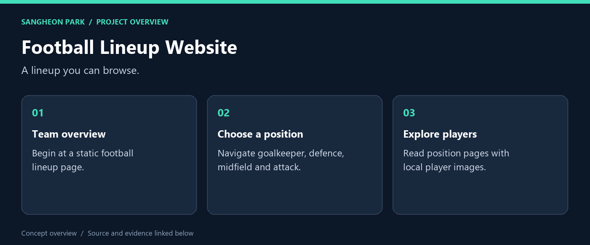
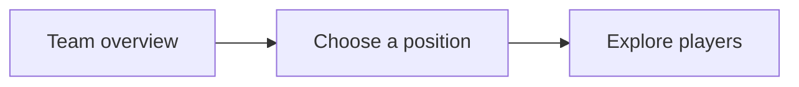

# Football Lineup Website

**An early HTML project organising a football lineup into an overview and four position pages.**



[What I built](#what-i-built) · [My role](#my-role) · [Code and reproduction](#code-and-reproduction) · [Portfolio](https://github.com/oldprize47-SH)

## What I built

| Deliverable | What it does | Explore |
|---|---|---|
| **Landing page** | Start the site locally | [Source / result](main.html) |
| **Defenders** | Position-page example | [Source / result](df.html) |
| **Forwards** | Another position-page example | [Source / result](fw.html) |

### Result at a glance

Source and paths inspected. No cross-browser or accessibility audit has been completed.


*Original project artwork; this is not a newly captured browser screenshot.*

## My role

The page implementation is presented as a learning project. Player imagery and other third-party assets retain their original ownership.

## How it works



## Code and reproduction

## Local viewing

Open `main.html` in a browser, or serve the folder locally:

```sh
python -m http.server 8000 --bind 127.0.0.1
```

Then visit `http://127.0.0.1:8000/main.html`. This binds to the local computer.
HTML sources and repository paths were inspected; a cross-browser or accessibility
review was not completed. No GitHub Pages deployment was enabled by this update.

## Source and credits

[Original repository](https://github.com/sangheon47/fifaweb) · [Portfolio home](https://github.com/oldprize47-SH)

[Original README](README.original.md) is retained alongside the source history.

Course scaffolding, team contributions and third-party assets retain their original attribution. This documentation does not grant a new licence.
