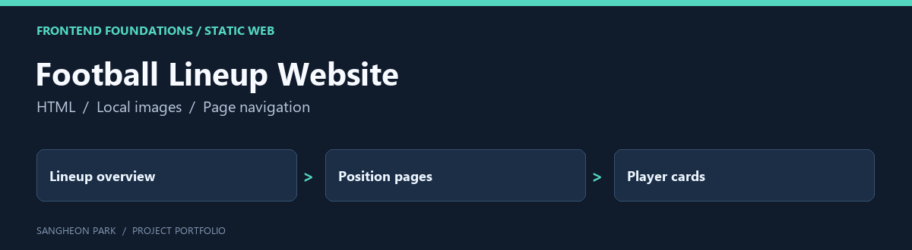

# Football Lineup Website



A small static website organised around a football lineup and position-specific pages. It is an early web exercise, separate from the engineering flagship projects.

[Portfolio home](https://github.com/oldprize47-SH) · [Original repository](https://github.com/sangheon47/fifaweb)

[Original project README](README.original.md)

## Contribution and context

The page implementation is presented as a learning project. Player imagery and other third-party assets retain their original ownership.

## Code map

| Entry | Purpose |
|---|---|
| [main.html](main.html) | Landing page |
| [gk.html](gk.html) | Goalkeeper page |
| [df.html](df.html) | Defender page |
| [mf.html](mf.html) | Midfielder page |
| [fw.html](fw.html) | Forward page |

## Local viewing

Open `main.html` in a browser, or serve the folder locally:

```sh
python -m http.server 8000 --bind 127.0.0.1
```

Then visit `http://127.0.0.1:8000/main.html`. This binds to the local computer.
HTML sources and repository paths were inspected; a cross-browser or accessibility
review was not completed. No GitHub Pages deployment was enabled by this update.

## Archive policy

The fork retains upstream history, source attributions and course material. The
portfolio documentation does not assign a new licence or claim sole authorship
of inherited code. Current checks are stated above; an untested component is not
presented as verified.
