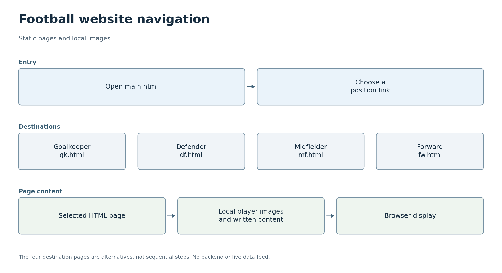

# 축구 라인업


[한국어](#korean) · [English](#english)


<a id="korean"></a>

## 한국어

[코드 읽는 순서](#코드-따라-읽기)


축구 라인업을 중심으로 구성한 정적 HTML 사이트입니다. 메인 페이지는 골키퍼, 수비수, 미드필더, 공격수의 별도 페이지로 연결되며, 로컬에 저장된 선수 이미지를 사용합니다.


### 프로젝트 목표


방문자가 서로 연결된 포지션별 페이지와 선수 이미지를 통해 축구 라인업을 살펴볼 수 있도록 합니다.


<sub>AI 생성 개념도</sub>


### 활용할 수 있는 곳


같은 페이지 구조를 작은 구단이나 학교 팀의 소개 사이트로 응용할 수 있습니다. 라인업을 소개하고, 선수를 포지션별로 묶으며, 개인 정보로 연결하는 방식입니다. 정적 페이지로 관리할 수 있는 콘텐츠에 적합합니다. 실시간 점수, 자동 명단 갱신, 사용자 계정은 별도로 추가해야 할 기능입니다.


### 한눈에 보기





<sub>[SVG](docs/flowcharts/football.svg)</sub>


### 사이트 구성


사이트는 여러 정적 페이지로 구성되어 있습니다. 메인 페이지는 라인업을 소개하고, 링크는 독자를 포지션별 페이지로 안내합니다. 각 페이지는 HTML 구조와 로컬 경로로 참조하는 선수 이미지를 함께 사용합니다. 사이트를 구동하는 Python 애플리케이션은 없습니다. 아래의 선택적 서버는 브라우저에 파일을 제공하는 역할만 합니다.


페이지와 자산을 연결하는 방법을 익히기 위한 실습으로, 데이터를 바탕으로 라인업을 생성하는 기능은 포함하지 않습니다. 축구 콘텐츠는 탐색 구조에 구체적인 주제를 부여합니다. Sangheon Park가 초기 웹 개발 실습으로 제작했습니다.


### 코드 따라 읽기

아래 순서는 파일의 역할과 연결을 이해하기 위한 안내입니다. 독립 과제나 보드별 프로그램은 한꺼번에 실행하지 않고 해당 항목의 실행 안내를 따릅니다.

| 순서 | 파일 | 역할과 다음 단계 |
|---|---|---|
| 1 | [main.html](main.html) | 메인 화면에서 포지션 페이지로 향하는 링크를 읽습니다. |
| 2 | [gk.html](gk.html) | 골키퍼 페이지의 이미지 경로와 메인 페이지로 돌아가는 연결을 확인합니다. |
| 3 | [df.html](df.html) | 수비수 페이지입니다. 같은 방식으로 mf.html과 fw.html도 비교합니다. |
| 4 | [mf.html](mf.html) | 미드필더 정보와 이미지가 HTML에 직접 들어가는 정적 페이지입니다. |
| 5 | [fw.html](fw.html) | 공격수 페이지입니다. HTML 수정 후 브라우저를 새로고침해 결과를 확인합니다. |

[기존 상세 튜토리얼과 원문](README.original.md)도 함께 보존했습니다.

### 프로젝트 보기


브라우저에서 [main.html](main.html)을 열어 살펴볼 수 있습니다. 로컬 서버를 이용하려면 다음 명령으로 저장소 파일을 제공하면 됩니다.


```sh

python -m http.server 8000 --bind 127.0.0.1

```


서버를 시작한 뒤 `http://127.0.0.1:8000/main.html`을 열면 사이트를 볼 수 있습니다.


포지션별 페이지는 [gk.html](gk.html), [df.html](df.html), [mf.html](mf.html), [fw.html](fw.html)입니다. 선수 이미지와 기타 제삼자 자산의 권리는 원래 권리자에게 있습니다.


구현이 궁금하다면 `main.html`에서 포지션 링크 하나를 따라가며 해당 페이지의 이미지 참조를 살펴보면 좋습니다. 사이트를 열거나 서버로 제공할 때는 원래 폴더 구조를 유지해야 합니다. 상대 링크는 페이지와 이미지가 놓인 위치에 따라 달라집니다. 빌드 도구나 백엔드를 도입하지 않고도 HTML 파일 하나만 수정해 해당 페이지를 실험할 수 있습니다.


로컬 서버 명령은 내 컴퓨터에서 사이트를 살펴보기 위한 선택지입니다. 배포 단계에 해당하지 않으며, 호스팅 서비스나 실시간 축구 데이터를 제공하는 기능은 추가하지 않습니다.


파일과 경로는 점검했습니다. 여러 브라우저 간 호환성이나 접근성 검토는 완료하지 않았으며, 이 저장소는 GitHub Pages로 배포되어 있지 않습니다.


[원본 저장소](https://github.com/sangheon47/fifaweb). 원래 이력과 저작자 표기를 유지합니다.


---


<a id="english"></a>

## English

[Code walkthrough](#code-walkthrough)


**Football Lineup Website**


This is a static HTML site organised around a football lineup. The main page links to separate goalkeeper, defender, midfielder and forward pages, with local player images.


### Project goal


Let visitors explore a football lineup through linked position pages and player images.


<sub>AI-generated concept illustration</sub>


### Where it could be used


The same page structure could be adapted into a small club or school-team showcase: introduce the lineup, group players by position and link to individual information. It is suitable for content that can be maintained as static pages. Live scores, automatic roster updates and user accounts would be separate additions.


### At a glance


<sub>[SVG](docs/flowcharts/football.svg)</sub>


### What is in the site


The site is organised as a set of static pages. The main page introduces the lineup, and links take the reader to the position pages. The pages combine HTML structure with locally referenced player images. There is no Python application behind the site; the optional server below only serves the files to a browser.


The exercise focuses on connecting pages and assets. It does not include data-driven lineup generation. The football content gives the navigation a concrete subject. It was created by Sangheon Park as an early web-development exercise.


### Code walkthrough

Use this order to understand each file and its connections. Independent exercises and board targets are not one executable; follow the relevant run instructions below.

| Step | File | Role and next step |
|---|---|---|
| 1 | [main.html](main.html) | Start with links from the main page to each position. |
| 2 | [gk.html](gk.html) | Inspect goalkeeper images and navigation back to the main page. |
| 3 | [df.html](df.html) | Inspect defenders, then compare the same structure in mf.html and fw.html. |
| 4 | [mf.html](mf.html) | Midfielder information and images are embedded in a static HTML page. |
| 5 | [fw.html](fw.html) | This is the forward page; refresh the browser after editing HTML to inspect the result. |

The [original tutorial and documentation](README.original.md) remain available in full.

### Viewing the project


You can explore the site by opening [main.html](main.html) in a browser. To view it through a local server, use:


```sh

python -m http.server 8000 --bind 127.0.0.1

```


Once the server is running, you can view the site at `http://127.0.0.1:8000/main.html`.


The position pages are [gk.html](gk.html), [df.html](df.html), [mf.html](mf.html) and [fw.html](fw.html). Player images and other third-party assets retain their original ownership.


To understand the implementation, begin with `main.html`, follow one position link and inspect the image references in that page. Keep the original folder layout when opening or serving the site; relative links depend on where the pages and images sit. Editing one HTML file is enough to experiment with that page without introducing a build tool or backend.


The local-server command lets you view the site on your own computer. It is not a deployment step and does not provide a hosted service or add live football data.


The files and their paths have been inspected. A cross-browser or accessibility review has not been completed, and this repository is not deployed through GitHub Pages.


[Original repository](https://github.com/sangheon47/fifaweb). Original history and attribution are retained.
