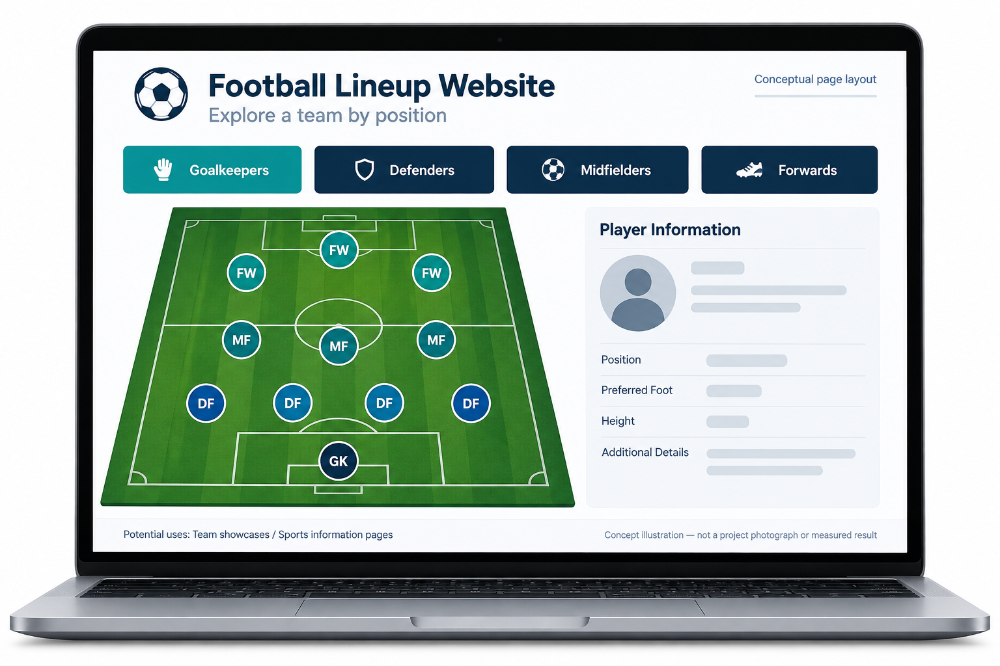

# 축구 라인업 웹사이트

[한국어](#korean) · [English](#english)

<a id="korean"></a>
## 한국어

축구 라인업을 중심으로 구성한 정적 HTML 사이트입니다. 메인 페이지는 골키퍼, 수비수, 미드필더, 공격수의 별도 페이지로 연결되며, 로컬에 저장된 선수 이미지를 사용합니다.

### 프로젝트 목표

방문자가 서로 연결된 포지션별 페이지와 선수 이미지를 통해 축구 라인업을 살펴볼 수 있도록 합니다.



AI로 생성한 콘셉트 일러스트입니다. 기기의 외형, 인터페이스 배치, 예시 그래픽은 설명을 위한 표현이며, 실제 프로젝트 사진이나 측정 결과가 아닙니다.

### 활용할 수 있는 곳

같은 페이지 구조를 작은 구단이나 학교 팀의 소개 사이트로 응용할 수 있습니다. 라인업을 소개하고, 선수를 포지션별로 묶으며, 개인 정보로 연결하는 방식입니다. 정적 페이지로 관리할 수 있는 콘텐츠에 적합합니다. 실시간 점수, 자동 명단 갱신, 사용자 계정은 별도로 추가해야 할 기능입니다.

### 한눈에 보기


문서화된 프로젝트 내용과 코드를 바탕으로 재구성한 개요입니다. 결과와 검증의 한계는 아래에 설명합니다. [SVG](docs/flowcharts/football.svg)

### 사이트 구성

사이트는 여러 정적 페이지로 구성되어 있습니다. 메인 페이지는 라인업을 소개하고, 링크는 독자를 포지션별 페이지로 안내합니다. 각 페이지는 HTML 구조와 로컬 경로로 참조하는 선수 이미지를 함께 사용합니다. 사이트를 구동하는 Python 애플리케이션은 없습니다. 아래의 선택적 서버는 브라우저에 파일을 제공하는 역할만 합니다.

데이터를 바탕으로 라인업을 생성하는 도구가 아니라 페이지와 자산을 연결하는 실습이었습니다. 축구 콘텐츠는 탐색 구조에 구체적인 주제를 부여합니다. Sangheon Park가 초기 웹 개발 실습으로 제작했습니다.

### 프로젝트 보기

브라우저에서 [main.html](main.html)을 열거나, 저장소 파일을 로컬 서버로 제공하세요.

```sh
python -m http.server 8000 --bind 127.0.0.1
```

그런 다음 `http://127.0.0.1:8000/main.html`을 여세요.

포지션별 페이지는 [gk.html](gk.html), [df.html](df.html), [mf.html](mf.html), [fw.html](fw.html)입니다. 선수 이미지와 기타 제삼자 자산의 권리는 원래 권리자에게 있습니다.

구현을 이해하려면 `main.html`에서 시작해 포지션 링크 하나를 따라가고, 해당 페이지의 이미지 참조를 살펴보세요. 사이트를 열거나 서버로 제공할 때는 원래 폴더 구조를 유지해야 합니다. 상대 링크는 페이지와 이미지가 놓인 위치에 따라 달라집니다. 빌드 도구나 백엔드를 도입하지 않고도 HTML 파일 하나만 수정해 해당 페이지를 실험할 수 있습니다.

로컬 서버 명령은 사이트를 보기 위한 선택지이며 배포 단계가 아닙니다. 이 명령으로 프로젝트가 호스팅 서비스가 되거나 실시간 축구 데이터가 추가되지는 않습니다.

파일과 경로는 점검했습니다. 여러 브라우저 간 호환성이나 접근성 검토는 완료하지 않았으며, 이 저장소는 GitHub Pages로 배포되어 있지 않습니다.

[원본 저장소](https://github.com/sangheon47/fifaweb). 원래 이력과 저작자 표기를 유지합니다.

---

<a id="english"></a>
## English

**Football Lineup Website**

This is a static HTML site organised around a football lineup. The main page links to separate goalkeeper, defender, midfielder and forward pages, with local player images.

### Project goal

Let visitors explore a football lineup through linked position pages and player images.


AI-generated concept illustration. Device appearance, interface layout and example graphics are illustrative, not project photographs or measured results.

### Where it could be used

The same page structure could be adapted into a small club or school-team showcase: introduce the lineup, group players by position and link to individual information. It is suitable for content that can be maintained as static pages. Live scores, automatic roster updates and user accounts would be separate additions.

### At a glance


Overview reconstructed from the documented project and code. Results and verification limits are described below. [SVG](docs/flowcharts/football.svg)

### What is in the site

The site is organised as a set of static pages. The main page introduces the lineup, and links take the reader to the position pages. The pages combine HTML structure with locally referenced player images. There is no Python application behind the site; the optional server below only serves the files to a browser.

This was an exercise in connecting pages and assets, rather than a data-driven lineup generator. The football content gives the navigation a concrete subject. It was created by Sangheon Park as an early web-development exercise.

### Viewing the project

Open [main.html](main.html) in a browser, or serve the repository locally:

```sh
python -m http.server 8000 --bind 127.0.0.1
```

Then open `http://127.0.0.1:8000/main.html`.

The position pages are [gk.html](gk.html), [df.html](df.html), [mf.html](mf.html) and [fw.html](fw.html). Player images and other third-party assets retain their original ownership.

To understand the implementation, begin with `main.html`, follow one position link and inspect the image references in that page. Keep the original folder layout when opening or serving the site; relative links depend on where the pages and images sit. Editing one HTML file is enough to experiment with that page without introducing a build tool or backend.

The local-server command is a viewing option, not a deployment step. It does not turn the project into a hosted service or add live football data.

The files and their paths have been inspected. A cross-browser or accessibility review has not been completed, and this repository is not deployed through GitHub Pages.

[Original repository](https://github.com/sangheon47/fifaweb). Original history and attribution are retained.
